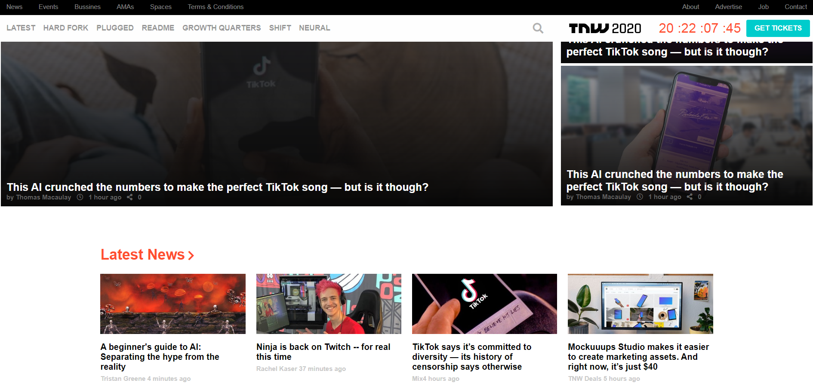

# TNW-responsive-clone

It is a clone from the home page but including fully responsive design. One very important requisite for this project was set 2 breakpoints to media queries, it was necessary to found them on the original page, which was a great opportunity to see how responsive design works. These 2 breakpoints are 768px - 1024px, the most responsive design happens inside this range but there are some special details happening at 1113px and 1200px in navbar.

## Built With

- HTML
- CSS

## Live Demo

[Live Demo Link](https://alansoto31.github.io/TNW-responsive-clone/)

## Prerequisites 

- Chrome browser

## Set up

 - $ cd "folder location"
 - $ git clone git@github.com:AlanSoto31/TNW-responsive-clone.git
* Install
* Usage 
* Run tests - HTML validator, w3 validation
* Deployment 

## Authors

👤 **Alan Soto** 

 - Github: AlanSoto31
 - Twitter: @Alan95081574
 - Linkedin: linkedin

 ## Show your support

- Give a ⭐️ if you like this project!

## Acknowledgments

- Inspired on the TNW web site.
https://thenextweb.com/